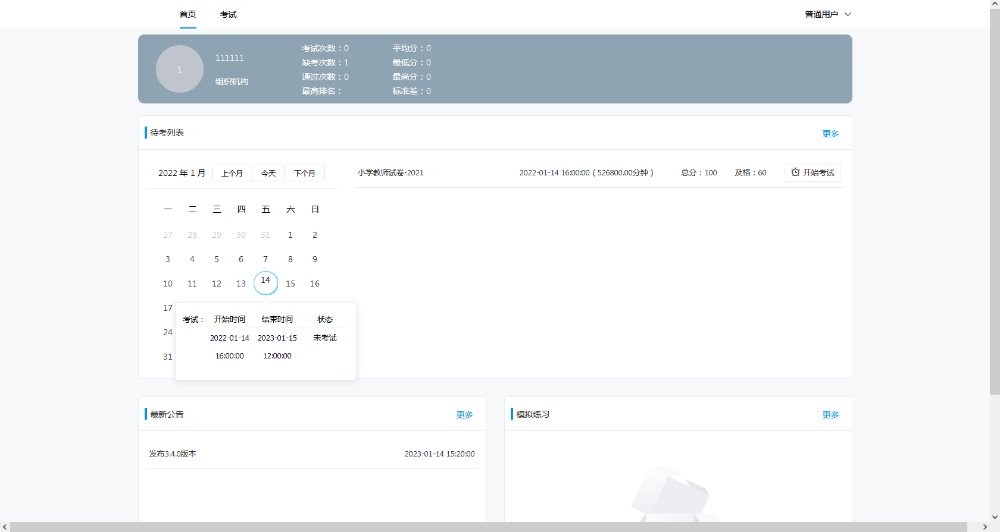
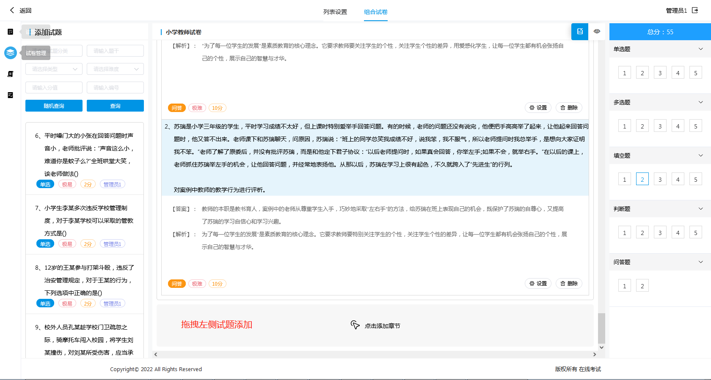
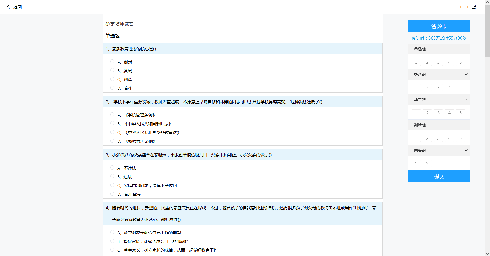
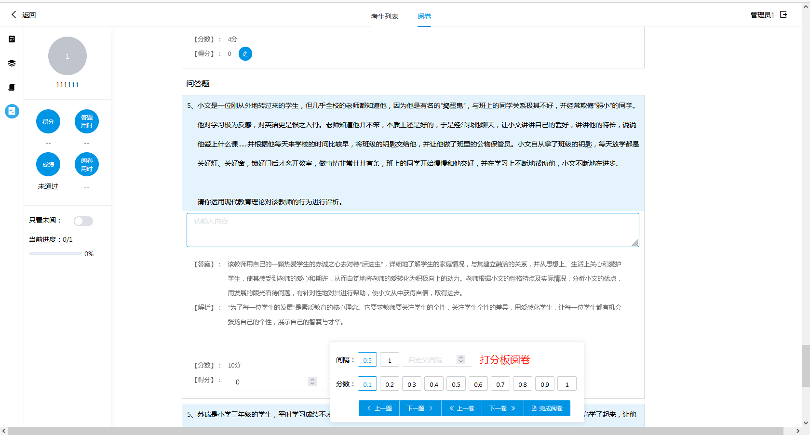
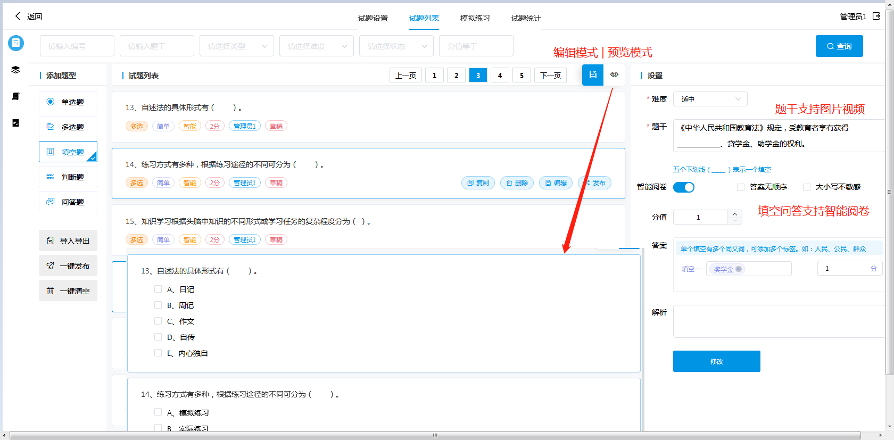

# 在线考试
## 演示地址
<a href="http://47.92.221.134:8080" target="_blank">演示地址</a>

## 界面
### 首页

### 人工组卷

### 考试答题

### 人工阅卷

### 编辑试题

### 考试统计

### 试题导入

### 一键安装

## 账号
系统管理员	admin	111111

## 文档
> <a href="doc">接口文档</a>

> <a href="doc">部署文档</a>

> <a href="h5">版本更新（前端）</a>

> <a href="src">版本更新（后端）</a>

## 技术实现
bs架构，采用开源组件jdk8、mysql5.7、springboot2x、elementUI2x

## 开源项目推荐
	
> WCP:知识管理系统 （内部资料上传检索知识共享）[https://gitee.com/macplus/WCP](https://gitee.com/macplus/WCP)

> WDA:文件转换组件（附件在线预览）[https://gitee.com/macplus/WDA](https://gitee.com/macplus/WDA)

> WTS:在线答题系统 [https://gitee.com/macplus/WTS](https://gitee.com/macplus/WTS)

> WLP:在线学习系统 [https://gitee.com/macplus/WLP](https://gitee.com/macplus/WLP)

> PLOGS:项目任务日志管理系统 （项目进度跟踪）[https://gitee.com/macplus/plogs](https://gitee.com/macplus/plogs)

> 知识库/在线答題/在线学习产品介绍 [http://www.wcpknow.com](http://www.wcpknow.com)